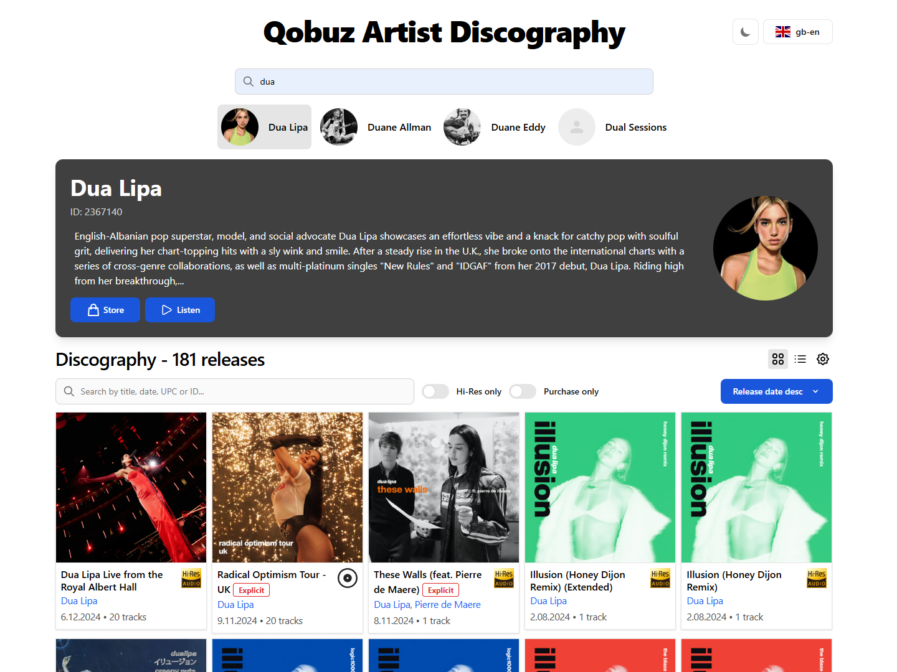

### https://qobuz-artist-discography.vercel.app

# 🎶 Qobuz Artist Discography

Small app that displays an artist's entire discography from Qobuz - including releases that don't always show up in the store or web player. I noticed Qobuz sometimes hides certain releases like remixes, or CD-quality versions, so this tool helps you see everything in one place. It's perfect for music lovers, collectors, and data nerds who want to explore every release an artist has ever published.

> [!WARNING]
> For artists with **large catalogs**, data may take up to **15 seconds** to load. Please be patient while the app gathers all releases.



## ✨ Features

- 🌗 Light / Dark mode
- 🛒 Store selection
- 🧑‍🎤 Artist bio and metadata
- 🖼️ Grid or list view of the discography
- ⚙️ Customizable album card layout
- 🔍 Advanced search & filtering
- ↕️ Extensive sorting options

### 🔎 Search Capabilities

Search albums by **title**, **release date**, **UPC**, or **album ID**.

| Type         | Example Query      | Description                    |
| ------------ | ------------------ | ------------------------------ |
| Title        | `radical optimism` | Find albums matching the title |
| Title        | `explicit`         | Show only explicit albums      |
| Release date | `2024-`, `2024-05` | Filter by release date         |
| UPC          | `5021732254870`    | Search by album UPC            |
| Album ID     | `nyoii27ora7kc`    | Search by Qobuz album ID       |

## 🧰 Installation (Run locally)

1. Install [Node.js](https://nodejs.org/en) and [Git](https://git-scm.com/)

2. Clone the repository:

   ```bash
   git clone https://github.com/pawllo01/qobuz-artist-discography.git
   ```

3. Install dependencies in the project directory:

   ```bash
   npm install --prefix ./client
   npm install --prefix ./server
   ```

4. Run the app

   Option 1 - Quick Launch (Windows)

   - Use the included `START.bat` script for a quick launch.
   - To stop the app, simply close both cmd.exe windows.

   Option 2 - Manual Start (Recommended for developers)

   - You can start each service manually:

     ```bash
     npm run start --prefix ./server
     npm run dev --prefix ./client
     ```

## 👨‍💻 Development

The project already includes `.env` files for both the **client** and **server**. You can edit these files if you need to change configuration values.

## 🧱 Used Technologies

- [React](https://react.dev/)
- [Flowbite](https://flowbite.com/) & [Flowbite React](https://flowbite-react.com/)
- [Tailwind CSS](https://tailwindcss.com/)
- [React Icons](https://react-icons.github.io/react-icons/)

## 🪪 License

This project is licensed under the [MIT License](LICENSE).
